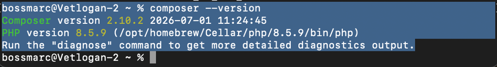
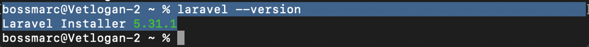
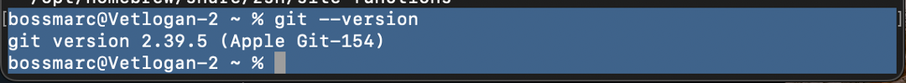
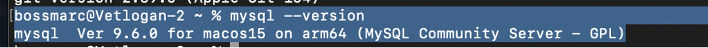
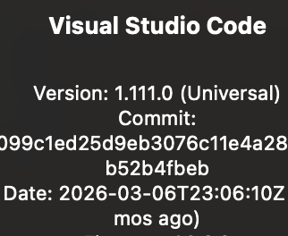
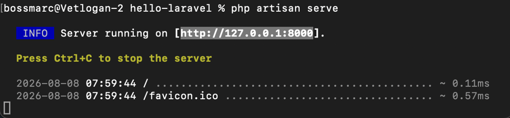
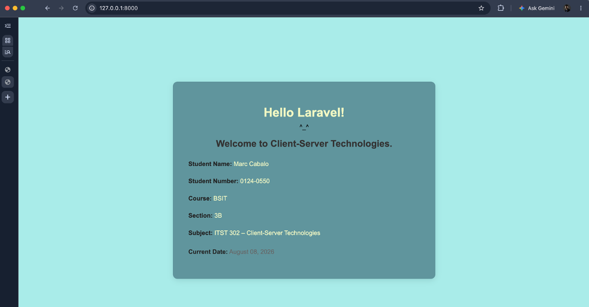

## PROJECT: Hello Laravel – Client-Server Technologies

## About Laravel

Laravel is a web application framework with expressive, elegant syntax. We believe development must be an enjoyable and creative experience to be truly fulfilling. Laravel takes the pain out of development by easing common tasks used in many web projects, such as:

- [Simple, fast routing engine](https://laravel.com/docs/routing).
- [Powerful dependency injection container](https://laravel.com/docs/container).
- Multiple back-ends for [session](https://laravel.com/docs/session) and [cache](https://laravel.com/docs/cache) storage.
- Expressive, intuitive [database ORM](https://laravel.com/docs/eloquent).
- Database agnostic [schema migrations](https://laravel.com/docs/migrations).
- [Robust background job processing](https://laravel.com/docs/queues).
- [Real-time event broadcasting](https://laravel.com/docs/broadcasting).

Laravel is accessible, powerful, and provides tools required for large, robust applications.

## Learning Laravel

Laravel has the most extensive and thorough [documentation](https://laravel.com/docs) and video tutorial library of all modern web application frameworks, making it a breeze to get started with the framework.

In addition, [Laracasts](https://laracasts.com) contains thousands of video tutorials on a range of topics including Laravel, modern PHP, unit testing, and JavaScript. Boost your skills by digging into our comprehensive video library.

You can also watch bite-sized lessons with real-world projects on [Laravel Learn](https://laravel.com/learn), where you will be guided through building a Laravel application from scratch while learning PHP fundamentals.

## Client-Server Technologies
is important because it provides the foundation for understanding how applications communicate between clients, such as web browsers, and servers that process requests and provide responses. Understanding this relationship is essential for developing modern web applications.

## The purpose of this project
 is to create a first Laravel application, configure the required development environment, run the application locally, customize its homepage, and publish the project to GitHub. This activity also provides hands-on experience with PHP, Composer, Laravel, Git, MySQL, Visual Studio Code, and GitHub.

## OBJECTIVES

At the end of this activity, the following objectives were achieved:
1. Install and verify PHP on macOS.
2. Install and verify Composer as the PHP dependency manager.
3. Install and verify the Laravel Installer.
4. Install and verify Git for version control.
5. Install and verify MySQL.
6. Set up Visual Studio Code as the development environment.
7. Create and run a Laravel application using php artisan serve.
8. Customize the Laravel homepage with student information and the current date.
9. Initialize Git and create the first project commit.
10. Push the Laravel project to a GitHub repository.

## Development Environment
## 4. Development Environment

| Software | Version |
|---|---|
| Operating System | macOS |
| PHP | 8.5.9 |
| Laravel Installer | 5.31.1 |
| Composer | 2.10.2 |
| Git | 2.39.5 (Apple Git-154) |
| MySQL | 9.6.0 |
| Visual Studio Code | 1.111.0 (Universal) |

## Installation Steps

- Step 1 – Install PHP
PHP was installed using Homebrew.
The installation was verified using:
php -v
The installed version was PHP 8.5.9.

- Step 2 – Install Composer
Composer was installed using Homebrew:
brew install composer
The installation was verified using:
composer -V
The installed version was Composer 2.10.2.

- Step 3 – Install Laravel
The Laravel Installer was installed using Composer:
composer global require laravel/installer
The Laravel installation was verified using:
laravel -v
The installed Laravel Installer version was 5.31.1.

- Step 4 – Install Git
Git was verified using:
git --version
The installed version was Git 2.39.5 (Apple Git-154).

- Step 5 – Install MySQL
MySQL was verified using:
mysql --version
The installed version was MySQL 9.6.0 for macOS on ARM64.

- Step 6 – Install Visual Studio Code
Visual Studio Code was installed and used as the main code editor for the Laravel project.
The hello-laravel project folder was opened in Visual Studio Code.

## Project Structure

- Laravel organizes an application into different directories, each with a specific purpose.
app/
- The app/ directory contains the main application code. This includes application logic, models, controllers, and other classes used by the Laravel application.
routes/
- The routes/ directory contains the application's route definitions. The web.php file is commonly used to define routes for web pages.
resources/
- The resources/ directory contains views and other frontend resources. In this project, the homepage was customized in:
resources/views/welcome.blade.php
public/
- The public/ directory is the web-accessible directory of the Laravel application. It contains the application's entry point and publicly accessible assets.
config/
- The config/ directory contains configuration files for different parts of the Laravel application.
database/
- The database/ directory contains database-related files, including migrations, seeders, and factories.

## Problems Encountered

- Problem 1 – Homebrew was not initially recognized
After installing Homebrew, the brew command initially returned:
zsh: command not found: brew
This prevented PHP and Composer from being installed through Homebrew.
- Problem 2 – Laravel command was not recognized
After installing the Laravel Installer through Composer, running:
laravel --version
returned:
zsh: command not found: laravel
The Laravel Installer was installed, but its executable directory was not included in the shell's PATH.
- Problem 3 – .zshrc PATH configuration error
While configuring the PATH, an incorrect Export command was placed in the .zshrc file. The Terminal returned:
command not found: Export
This caused an error when reloading the shell configuration.
- Problem 4 – GitHub authentication
When pushing the project to GitHub through HTTPS, GitHub requested authentication. A Personal Access Token was required instead of the regular GitHub account password.

## Solutions

- Solution 1 – Configure Homebrew
Homebrew's shell environment was loaded using:
eval "$(/opt/homebrew/bin/brew shellenv)"
After this, the brew command became available.
- Solution 2 – Configure Laravel's PATH
Composer's global executable directory was identified using:
composer global config bin-dir --absolute
The returned directory was:
/Users/bossmarc/.composer/vendor/bin
This directory was added to .zshrc:
export PATH="$HOME/.composer/vendor/bin:$PATH"
The configuration was then reloaded using:
source ~/.zshrc
After this, the laravel command worked correctly.
- Solution 3 – Correct the .zshrc configuration
The incorrect Export command was changed to the correct lowercase shell command:
export
The PATH configuration was then saved and reloaded successfully.
- Solution 4 – Authenticate with GitHub
A GitHub Personal Access Token was created and used for authentication when pushing the local Laravel project to GitHub. The project was successfully uploaded to the repository.

## Screenshots
## 9. Screenshots

### PHP Version

### Composer Version

### Laravel Version

### Git Version

### MySQL Version

### Visual Studio Code

### Laravel Artisan Serve

### Hello Laravel Homepage

## Reflection

This activity helped me understand the basic process of setting up a Laravel development environment and creating my first Laravel application. Before starting the activity, I understood that PHP was used for server-side programming, but I had less practical experience with the tools needed to develop a complete PHP web application. Through this activity, I learned how PHP, Composer, Laravel, MySQL, Git, Visual Studio Code, and GitHub work together in a development environment.
One of the most useful things I learned was how to install and verify each development tool using the Terminal. I also learned that installing a program does not always mean that the Terminal can immediately recognize its command. I experienced this when Homebrew initially returned a “command not found” error and when the Laravel command was not recognized after installing the Laravel Installer. I learned how the PATH environment variable allows the Terminal to locate installed programs. I also learned how to correct configuration problems in the .zshrc file.
Another challenge was learning the basic Git workflow. I learned how to initialize a Git repository, stage files, create a commit, connect a local project to a GitHub repository, and push the project online. This gave me a better understanding of version control and why it is important when developing software.
Laravel is important in client-server development because it provides a structured framework for building server-side web applications. Instead of creating every feature from the beginning, developers can use Laravel's routing, views, database tools, and other built-in features. This makes development more organized and maintainable.
This knowledge will help me in future software development projects because I now understand the basic workflow of creating a web application, running it locally, managing its source code with Git, and publishing it through GitHub. The experience also gave me more confidence in using the Terminal and development tools. As I continue learning, I can build more advanced Laravel applications that communicate with databases and provide dynamic services to users.

## License

The Laravel framework is open-sourced software licensed under the [MIT license](https://opensource.org/licenses/MIT).
